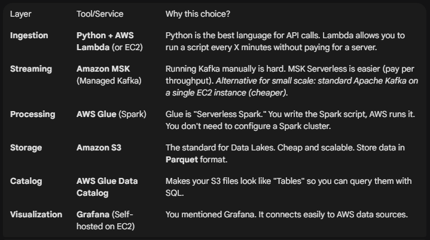
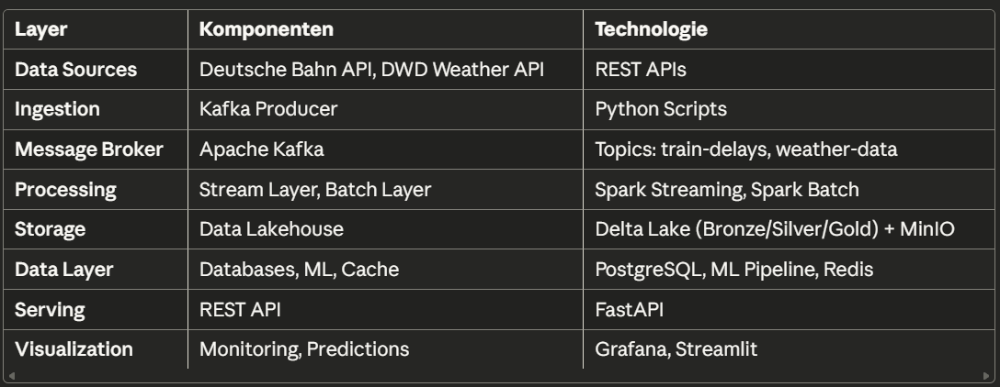

#  Big Data Praktikum Notizen

## 

## Idee 1: Zug Verspätung vorhersagen mit Wetterdaten

## **Question**: Will my train be late based on weather, time of day, and season?

**What you analyze**:

* Historical delay patterns (which routes/times are always late?)  
* Weather impact (delays during snow/rain?)  
* Rush hour vs. off-peak reliability  
* Seasonal trends (winter worse than summer?)

**Data sources**:

1. **Deutsche Bahn API** \- [https://v6.db.transport.rest/](https://v6.db.transport.rest/)  
   * Real-time train delays & cancellations  
   * 5,000+ stations  
   * free, no API key needed  
   * Updates every 30-60 seconds  
2. **DWD Weather API** \- [https://brightsky.dev/](https://brightsky.dev/)  
   * Hourly weather from 500+ German stations  
   * Temperature, rain, wind, snow  
   * free, unlimited  
   * Historical data available  
3. **Optional: HVV Hamburg** \- [https://v5.hvv.transport.rest/](https://v5.hvv.transport.rest/)  
   * Local Hamburg trains/buses  
   * [hvv-rest/docs/api.md at 5 · derhuerst/hvv-rest](https://github.com/derhuerst/hvv-rest/blob/5/docs/api.md)  
   * Same format as DB API  
   * free, no limits

**Daily data volume**: \~100,000 train records \+ 12,000 weather readings \= 112K records/day

**What you build**:

* Kafka ingests train delays \+ weather every minute  
* Spark processes and joins the data  
* ML model predicts: "Your 5pm train: 85% chance of 10min delay"  
* Dashboard shows most reliable routes/times

## Idee 2: Staus vorhersagen

## **Question**: Will I experience congestion at a specific point in \<city\> given a time and the weather

**What you analyze**:

- Historical congestion patterns (which routes/times are always late?)  
- Weather impact (delays during snow/rain?)  
- Rush hour vs. off-peak reliability  
- Seasonal trends (winter worse than summer?)  
- Verkehrsdaten  
  - [https://developer.tomtom.com/	traffic-api/documentation/tomtom-maps/product-information/introduction\#getting-started](https://developer.tomtom.com/traffic-api/documentation/tomtom-maps/product-information/introduction#getting-started)   
    - API Key: C9A2Op6bcWPrr2AGEJv6mFpdz3aOftO1  
  - [https://developer.here.com/documentation/traffic-api/dev\_guide/index.html](https://developer.here.com/documentation/traffic-api/dev_guide/index.html)  
  - [https://mobilithek.info/](https://mobilithek.info/)  
  - HERE API, freemium run 8,300 calls im Tag  
  - Alle 1 \- 5 min. geupdated  
- Wetterdaten  
  - [https://openweathermap.org/api](https://openweathermap.org/api)   
    - API Key: 76d3c2c705805e009533b5cee35fafef

## Idee 3: Luftqualität 

## **Question**: How is the air quality impacted by traffic and/or the weather

- Verkehrsdaten  
  - Gleich wie Idee 1 und 2  
- Wetterdaten  
  - Gleich wie Idee 1 und 2  
- Luftqualitätsdaten  
  - [https://openaq.org/\#/?\_k=jxqj1x](https://openaq.org/#/?_k=jxqj1x)  
    - API key: 6138b79ce354c68f0680ae094f3f72ea17f22e7f45c53c2a787325d841dd8e6b  
  - [https://www.airnow.gov/](https://www.airnow.gov/)  
  - [https://www.eea.europa.eu/en/datahub/datahubitem-view/3b390c9c-f321-490a-b25a-ae93b2ed80c1](https://www.eea.europa.eu/en/datahub/datahubitem-view/3b390c9c-f321-490a-b25a-ae93b2ed80c1)   
- E-Autos  
  - [https://www.kba.de/DE/Statistik/Fahrzeuge/Neuzulassungen/neuzulassungen\_node.html](https://www.kba.de/DE/Statistik/Fahrzeuge/Neuzulassungen/neuzulassungen_node.html)  
  - Monatlich updated  
  - [https://www.kba.de/DE/Statistik/Fahrzeuge/Neuzulassungen/Motorisierung/motorisierung\_node.html](https://www.kba.de/DE/Statistik/Fahrzeuge/Neuzulassungen/Motorisierung/motorisierung_node.html)  
  - Nur bis 2023, jährliche updates  
  - Anzahl neue EVs in einer Stadt  
  - Total Anzahl EVs in einer Stadt

Architektur flow:

Kafka (data ingestion) → Spark (Batch processing for stream data) → Data Lakehouse (Storage) → Analytics/ ML

Bronze Layer: Raw Data  
Silver: Cleaned Data:  
Gold: Data to be analyzed

Oder Flink

Verteilt: spark → läuft immer verteilt, cluster von N rechnern, 1 rechner ist auch N.   
S  
Lake house → storage skalieren, public cloud, studenten guthaben, limit aufpassen. 